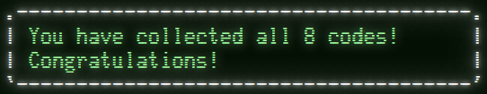

These are my solutions to the [Synacor Challenge](https://challenge.synacor.com/).

The Synacor Challenge is a programming challenge by Eric Wastl.  In nature, it's similar to some of the challenges in his [Advent of Code](http://adventofcode.com/), most notably, from 2019, starting with day 2.

Put simply, it's an implementation of a state machine that plays through a text adventure.  Completing the challenge requires both implementing the machine, as well as debugging the code inside of the state machine.  To get to the end, not only will you need to be able to understand the code of the machine itself, but make some modifications to it.

If you'd like, you can peruse the source code in this repo.  It includes an implementation, some helpers that I used to solve the puzzles in the game, as well as the puzzles in the meta-game.  `challenge.py` is probably the best starting point.  `program.py` is my implementation of the state machine, complete with the debugging and backdoors I needed to work through the last codes.

I've left a small write-up of some notes I took while working through the challenge.  You can read them [here](spoilers.md).  It contains many spoilers for the challange.

If you just want to see what it's like to run, I also produced two animations.  The [first](https://seligman.github.io/synacor/run_script.html) is a run through, showing the complete play through.  The [second](https://seligman.github.io/synacor/run_script_speed.html) is a "speedrun", showing the run through, but using all of the information I gathered to skip large parts of the playthrough itself, getting the codes as fast as possible.  Both of these contain spoilers as well, of course.
