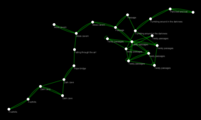

The are two codes that you can find before the main game itself.  The first is the easiest, it's in the archecticture specification itself.  The second is given to you when you've implemented the first few of the opcodes as the spec suggests.

Once you've implemented the rest of the opcodes and pass the machine's self-test, you get the third code, and the the main event starts with a text adventure:

    == Foothills ==
    You find yourself standing at the base of an enormous mountain.  At 
    its base to the north, there is a massive doorway.  A sign nearby 
    reads "Keep out!  Definitely no treasure within!"

    Things of interest here:
    - tablet

    There are 2 exits:
    - doorway
    - south

    What do you do?

The forth code is given to you when you use the tablet.  From here, and as with all text adventures, I find it useful to map out the rooms.  This one is no different, I created maps for each of the three levels of the game:

And once you pick up and equip a lantern, the map changes subtly because a [Grue](https://en.wikipedia.org/wiki/Grue_%28monster%29) eats you in the dark in the first map:

In the twisty passages, you'll find the fifth code in the ruins themselves.You'll also find five coins.  In my `challange` helper, `solve_coins` will solve the simple math puzzle to place them in the right order in a room.  Once done, you encounter a teleporter.  Using the teleporter revelas the sixth code, and takes you to the headquarters, a fairly simple level:

All though simple in layout, this is perhaps the most complex part of the game.  You'll need to decode part of the machine code, understand what it's doing, and implement it in some faster language to figure out what it should be producing.  `energy_level` is my implemention of that, it produces the correct output.  Once done, you'll need to inject the result into a specific memory register, and likely will want to change some of the logic of how the program works to make use of the transporter again to reveal the seventh code, and take you to another map:

This is a straight forward map, though the grid at the end is itself a puzzle.  Following some clues in a journal and on the walls and floors you need to work through the maze in a specific order, taking the shortest path possible, to complete another math challange.  `vaults` is my helper to find the correct path.  Once done there, the final code is revealed.

    Congratulations; you have reached the end of the challenge!
